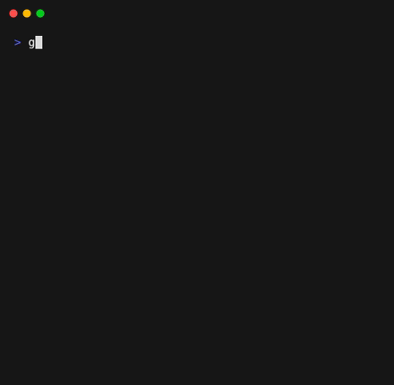

# go-tic-tac-toe

[](https://pkg.go.dev/github.com/neocotic/go-tic-tac-toe)
[](https://github.com/neocotic/go-tic-tac-toe/blob/main/LICENSE.md)

A fun tic-tac-toe game written in Go (golang).

## Installation

Install using [go install](https://go.dev/ref/mod#go-install):

``` sh
go install github.com/neocotic/go-tic-tac-toe
```

Then import the package into your own code to use the API:

``` go
import "github.com/neocotic/go-tic-tac-toe"
```

Or run it to use the CLI:

``` sh
go run github.com/neocotic/go-tic-tac-toe/cmd
```

## Documentation

Documentation is available on [pkg.go.dev](https://pkg.go.dev/github.com/neocotic/go-tic-tac-toe#section-documentation).
It contains an overview and reference.

The CLI usage is as follows:

```
Usage of go-tic-tac-toe:
  -bot string
    	enable bot opponent with difficulty (e.g. "normal")
  -help
    	print help
  -no-mouse
    	disable mouse support
  -player uint
    	starter player (default 1)
  -size uint
    	size of board (default 3)
```

### Example

The API can be used to implement your own UI:

``` go
func main() {
    g := tictactoe.MustStart()
    player, state := g.Player(), g.State()

    var err error
    for state == tictactoe.StateAwaitingTurn {
        if state, player, err = g.Play(player, getInput()); err != nil {
            renderError(err)
        } else {
            renderBoard(g)
        }
    }

    switch state {
    case tictactoe.StateDraw:
        renderDrawMsg()
    case tictactoe.StateWon:
        renderWinnerMsg(player)
    }
}

func getInput() tictactoe.Cell { /* ... */ }

func renderBoard(g tictactoe.Game) { /* ... */ }

func renderDrawMsg() { /* ... */ }

func renderError(err error) { /* ... */ }

func renderWinnerMsg(winner Player) { /* ... */ }
```

In order to play against a bot the `main` function above can be changed to the following:

``` go
g := tictactoe.MustStart(tictactoe.WithHardBot(tictactoe.PlayerTwo))
player, state := g.Player(), g.State()

var err error
for state == tictactoe.StateAwaitingTurn {
    if state, player, err = g.Play(player, getInput()); err != nil {
        renderError(err)
    } else if state, player, err = g.AllowBotTurn(); err != nil {
        renderError(err)
    } else {
        renderBoard(g)
    }
}

switch state {
case tictactoe.StateDraw:
    renderDrawMsg()
case tictactoe.StateWon:
    renderWinnerMsg(player)
}
```

Or play using the CLI:



Both the API and CLI offer customization options.

## Issues

If you have any problems or would like to see changes currently in development you can do so
[here](https://github.com/neocotic/go-tic-tac-toe/issues).

## Contributors

If you want to contribute, you're a legend! Information on how you can do so can be found in
[CONTRIBUTING.md](https://github.com/neocotic/go-tic-tac-toe/blob/main/CONTRIBUTING.md). We want your suggestions and
pull requests!

A list of contributors can be found in [AUTHORS.md](https://github.com/neocotic/go-tic-tac-toe/blob/main/AUTHORS.md).

## License

Copyright © 2024 neocotic

See [LICENSE.md](https://github.com/neocotic/go-tic-tac-toe/raw/main/LICENSE.md) for more information on our MIT
license.
